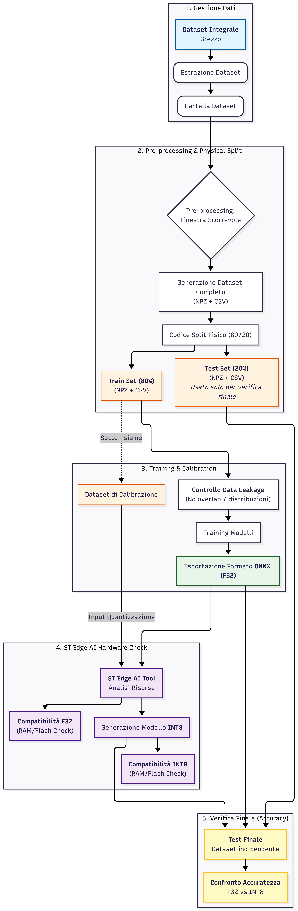

# DC-ARC-Fault ⚡

Pipeline completa per la rilevazione di **DC Arc Fault** in impianti fotovoltaici tramite tecniche di **Deep Learning** e **Time Series Classification**, con supporto al deployment su dispositivi embedded mediante **ST Edge AI**.

---

# 🧠 Obiettivo del Progetto

L'obiettivo del progetto è sviluppare un sistema di classificazione in grado di identificare fault da arco elettrico DC in segnali provenienti da impianti fotovoltaici, ottimizzando contemporaneamente:

- accuratezza del modello
- robustezza contro il data leakage
- compatibilità con sistemi embedded
- inferenza real-time su hardware edge

La pipeline include:

- costruzione del dataset
- preprocessing e controllo del leakage
- training di modelli deep learning e feature-based
- esportazione in formato ONNX
- quantizzazione INT8
- validazione su hardware edge STM32

---

# 📁 Struttura del Progetto

```text
DC-ARC-Fault/
│
├── dataset/                                 # GESTIONE DATI
│   ├── dataset/                             # Dataset grezzo originale (IEEE DataPort)
│   ├── dataset_new/                         # Dataset processato (windowing + split)
│   │   ├── train/
│   │   └── test/
│   │
│   ├── build_dataset_new.py                 # Costruzione finestre temporali
│   ├── split_dataset.py                     # Split fisico Train/Test
│   └── check.py                             # Verifica integrità e controllo leakage
│
├── script/
│   ├── training/                            # FASE 1 — TRAINING
│   │   ├── inception_time/
│   │   │   ├── risultati_finali/
│   │   │   ├── train_inceptiontime_gpu.py
│   │   │   └── *.keras
│   │   │
│   │   ├── mcnn/
│   │   │   ├── results/
│   │   │   └── train_hydra.py
│   │   │
│   │   └── multirockethydra/
│   │       ├── results/
│   │       └── train_multirocket_fixed.py
│   │
│   ├── onnx/                                # FASE 2 — EXPORT & OTTIMIZZAZIONE
│   │   ├── dataset_ottimizzazione/
│   │   │   └── calibration_inceptiontime/
│   │   │
│   │   ├── export_mcnn/
│   │   └── export_mcnn.py
│   │
│   └── std_edge/                            # FASE 3 — DEPLOYMENT EDGE AI
│       └── modelli_quantizzati/
│           ├── inception/
│           │   ├── Confronto_modelli.py
│           │   └── *_quant_calibra.onnx
│           │
│           └── mcnn/
│               └── Confronto_modelli.py
│
├── pipeline.png                             # Workflow della pipeline
└── README.md
```

---

# 📚 Dataset

Il progetto utilizza il dataset pubblico:

## Photovoltaic (PV) DC Arc-Fault Library

https://ieee-dataport.org/open-access/photovoltaic-pv-dc-arc-library

Dal dataset originale vengono estratti i segnali di:

- corrente
- tensione
- potenza

Dataset preprocessato disponibile anche su Kaggle:

https://www.kaggle.com/datasets/yassirsuarez/dc-arc-fault

Successivamente i segnali vengono trasformati in finestre temporali supervisionate utilizzabili dai modelli di classificazione.

---

# 🔄 Pipeline del Progetto



La pipeline è suddivisa in sei fasi principali.

---

# 1️⃣ Data Management

Il dataset grezzo viene:

- validato
- organizzato
- convertito in una struttura coerente per il training

Questa fase comprende:

- caricamento dei segnali originali
- verifica dell'integrità dei dati
- preparazione delle serie temporali

---

# 2️⃣ Preprocessing & Physical Split

I segnali vengono preprocessati tramite:

- segmentazione con finestra scorrevole
- normalizzazione
- costruzione dei sample supervisionati

Script principale:

```bash
python build_dataset_new.py
```

Successivamente viene eseguito uno split fisico tramite:

```bash
python split_dataset.py
```

## Dataset generati

- Train Set → 80%
- Test Set → 20%

Lo split viene effettuato **prima del training** per evitare:

- overlap tra finestre
- contaminazione tra train e test
- data leakage temporale

I dataset finali vengono salvati nei formati:

- `.npz`
- `.csv`

---

# 3️⃣ Training & Feature Extraction

La cartella:

```text
script/training/
```

contiene differenti approcci di classificazione.

| Modello | Descrizione |
|---|---|
| InceptionTime | Deep Learning per Time Series Classification |
| MCNN | Multi-scale Convolutional Neural Network |
| MultiRocket + Hydra | Approccio feature-based ad alte prestazioni |

Durante il training vengono eseguiti:

- controllo anti data leakage
- verifica distribuzione classi
- normalizzazione globale
- feature extraction
- training e validazione

---

# 4️⃣ Export ONNX & Quantizzazione

I modelli addestrati vengono esportati nel formato:

```text
ONNX (FP32)
```

Script principale:

```bash
python export_mcnn.py
```

Un sottoinsieme del train set viene utilizzato come:

- dataset di calibrazione
- supporto alla quantizzazione INT8

---

# 5️⃣ Deployment su ST Edge AI

I modelli vengono validati tramite:

- ST Edge AI Core
- ST Edge AI Developer Cloud

Obiettivi:

- riduzione dell'utilizzo di memoria
- inferenza embedded real-time
- compatibilità con hardware STM32

Configurazioni analizzate:

| Configurazione | Obiettivo |
|---|---|
| FP32 | Accuratezza massima |
| INT8 | Ottimizzazione Edge AI |

Metriche monitorate:

- RAM usage
- Flash usage
- tempo di inferenza
- accuratezza post-quantizzazione

---

# 6️⃣ Valutazione Finale

Il test set rimane completamente indipendente dall'intero processo di training e calibrazione.

Vengono confrontati:

- modello FP32
- modello INT8

Metriche finali:

- Accuracy
- Precision
- Recall
- F1-score
- Impatto della quantizzazione

---

# 🛠️ Tecnologie Utilizzate

## Machine Learning / Deep Learning

- PyTorch
- NumPy
- Scikit-learn
- ONNX
- MultiRocket
- Hydra
- InceptionTime

## Edge AI

- ST Edge AI
- STM32
- Quantizzazione INT8

---

# 🚀 Esempio di Training

```bash
python train_multirocket_fixed.py \
    dataset_train.npz \
    dataset_test.npz \
    --out ./results
```

---

# 🎯 Obiettivi Tecnici

- rilevazione real-time di archi DC
- riduzione del data leakage
- deployment embedded
- ottimizzazione memoria/inferenza
- pipeline scalabile e riproducibile

---

# 📄 Licenza

Il dataset originale appartiene ai rispettivi autori del progetto pubblicato su IEEE DataPort.

Il codice del repository è distribuito secondo la licenza specificata nel progetto.